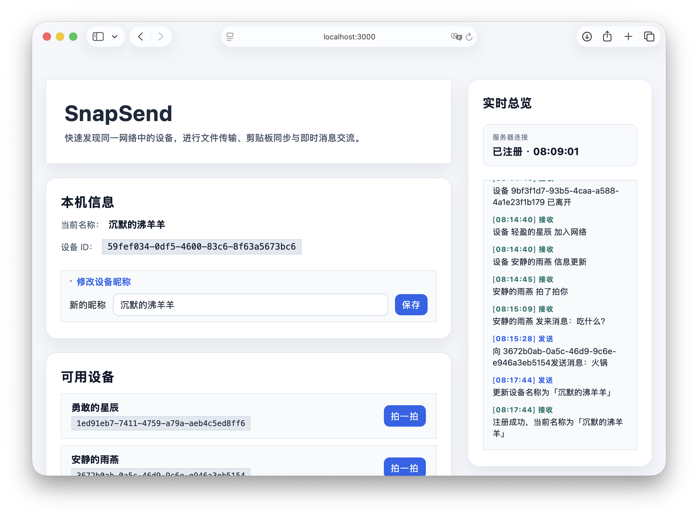

# SnapSend - 基于浏览器的多设备协作

[](https://nodejs.org/)

局域网内的零安装协作面板，只需要在一台设备上运行本服务，多个设备通过浏览器便可互相发现并协作，支持多设备剪贴板富文本传输、文件传输、即时通信。致力于解决 Windows 和 Mac 同步剪贴板和传输文件的痛点。

##  快速开始

只需要在一台设备上运行本服务，同一局域网其他设备通过浏览器即可使用
> 需要已安装 Node.js
1. **安装依赖**
   ```bash
   npm install
   ```
2. **启动服务**
   ```bash
   npm start
   ```
   默认监听 `http://localhost:3000`。同一局域网内的其他设备可通过终端输出的局域网地址访问。
3. **访问页面**

   打开终端提示的链接（如 `http://192.168.x.x:3000`），多个设备同时打开页面即可互相发现并开始协作。

##  配置选项

- `PORT` 环境变量或 `--port` / `-p` CLI 参数：自定义监听端口。
  ```bash
  PORT=8080 npm start
  # 或
  node index.js --port 8080
  ```
- 默认会在后台定期心跳检测， 60 秒未响应的客户端会被自动清理。

## 设置开机自启

通过 [PM2](https://pm2.keymetrics.io/) 可以把 SnapSend 作为后台服务，并随系统启动自动运行。
- **使用 PM2 启动服务**：
  `
  pm2 start node --name SnapSend -- index.js
  `
  

- **设置系统自启**
  1. 运行 
  `pm2 startup`，
  按照提示执行生成的命令（不同系统会输出不同指令，如 macOS 会输出 sudo launchctl ...，Linux 会输出 sudo systemctl ...）。
  2. 执行 `pm2 save` 保存当前进程列表，自启时会自动恢复。
- **取消开机自启**
  1. 删除进程：`pm2 delete SnapSend`
  2. 取消系统服务：`pm2 unstartup`

##  使用指南

- **修改设备昵称**：在左侧「本机信息」中填写新昵称并保存，昵称会缓存到 `localStorage`，下次打开自动恢复。

<table align="center">
  <tr>
    <td align="center">
      <br>
      <em>主界面概览</em>
    </td>
    <td align="center">
      <br>
      <em>修改昵称</em>
    </td>
  </tr>
</table>

- **传输文件**：
  1. 在「文件传输」卡片选择目标设备。
  2. 选择任意文件并点击「发送文件」。
  3. 页面会实时展示进度与当前传输方式。

<table align="center">
  <tr>
    <td align="center">
      <br>
      <em>文件发送</em>
    </td>
    <td align="center">
      <br>
      <em>文件接收</em>
    </td>
  </tr>
</table>

- **共享剪贴板**：
  1. 输入或粘贴内容，或直接点击「推送剪贴板」自动读取系统剪贴板。
  2. 浏览器若阻止直接读取，会弹出粘贴对话框；在对话框中按 `Ctrl+V / ⌘V` 即可捕获富文本并保持原样。
  3. 选择目标（或广播）后发送，对方收到后可一键复制并保留格式。

<table align="center">
  <tr>
    <td align="center">
      <br>
      <em>剪贴板同步</em>
    </td>
    <td align="center">
      <br>
      <em>粘贴对话框</em>
    </td>
  </tr>
</table>

- **即时消息**：在聊天区域输入内容，选择单个设备或广播后发送，历史消息会自动滚动。

<table align="center">
  <tr>
    <td align="center">
      <br>
      <em>即时消息</em>
    </td>
    <td align="center">
      <br>
      <em>聊天示例</em>
    </td>
  </tr>
</table>

- **查看实时日志**：右侧面板展示服务器连接状态、事件摘要及最近活动。

##  项目结构

```text
SnapSend/
├── index.html      # 浏览器端 UI 入口
├── styles.css      # 界面样式与布局
├── app.js          # 前端逻辑：状态管理、WebRTC、UI 交互
├── index.js        # Node.js 信令 & 静态资源服务器
├── package.json    # 项目元数据与 npm 脚本
├── docs/           # 项目说明文档资源
└── README.md       # 项目说明文档
```

##  功能亮点

### 所有的功能都是本地实现的

* **文件传输**：基于 WebSocket 的本地文件传输。
* **剪贴板共享**：同步剪贴板时尽可能保留 HTML/RTF 等富文本格式，支持一键复制。
* **即时消息**：简单的群聊/单聊能力用于临时协调和沟通。
* **“拍一拍”提醒**：快速向特定设备发送轻量级提醒，帮助确认连接或提醒注意。
* **自动设备发现**：打开网页即可自动注册到局域网信令服务器，实时看到在线设备列表并支持自定义昵称。
* **实时总览**：统一的实时事件面板，按发送/接收/状态分类展示事件。


##  关键实现

- **WebRTC 握手**：通过 WebSocket 交换 SDP/ICE 信息；若数据通道建立失败会回退到 WebSocket 分块传输。
- **设备管理**：服务器端维护在线客户端表，建立/清理连接时广播 `peer-joined`、`peer-left` 等事件，前端动态刷新下拉列表。
- **传输追踪**：前端为每个传输构建可视化进度组件，支持失败/完成提示并自动滚动到最新状态。
- **原生技术**：原生 Web 技术构建的单页应用，无需任何框架。
- **健壮性**：内置指数退避的 WebSocket 重连策略、传输超时控制以及 Base64 分块重组。


---

© 2025 achieveil. All rights reserved.
